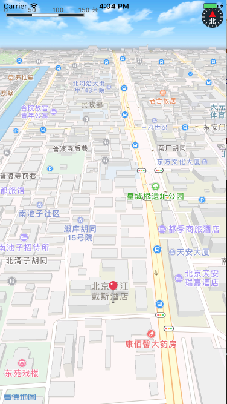

# iOS-map-rotation-effect
地图绕中心点旋转效果 （支付宝AR红包地图手势效果）

## 前述 ##
- [高德官网申请Key](http://lbs.amap.com/dev/#/).
- 阅读[开发指南](http://lbs.amap.com/api/ios-sdk/summary/).
- 工程基于iOS 3D地图SDK实现

## 核心类/接口 ##
| 类    | 接口  | 说明   | 版本  |
| -----|:-----:|:-----:|:-----:|
| ViewController	| - (CGFloat)degressAForPointA:(CGPoint)pointA pointB:(CGPoint)pointB centerPoint:(CGPoint)centerPoint | 通过余弦定理计算需要旋转的角度 | v4.0.0+ |
| ViewController	| - (BOOL)isCounterClockwiseForPointA:(CGPoint)pointA centerPoint:(CGPoint)pointCenter pointB:(CGPoint)pointB | 通过向量叉积计算出示顺时针旋转还是逆时针旋转 | v4.0.0+ |

## 核心难点 ##
objective c

``` objc
- (CGFloat)degressAForPointA:(CGPoint)pointA pointB:(CGPoint)pointB centerPoint:(CGPoint)centerPoint
{
    CGFloat b = [self distanceFromPointA:pointA toPointB:centerPoint];
    CGFloat c = [self distanceFromPointA:centerPoint toPointB:pointB];
    CGFloat a = [self distanceFromPointA:pointB toPointB:pointA];
    
    ///余弦定理
    CGFloat cosA = (pow(b, 2) + pow(c, 2) - pow(a, 2)) / (2*b*c);
    
    // 0 到 180度
    return acos(cosA)/M_PI * 180;
}

- (BOOL)isCounterClockwiseForPointA:(CGPoint)pointA centerPoint:(CGPoint)pointCenter pointB:(CGPoint)pointB
{
    // 以center point 为原点的向量a
    CGPoint vectA = CGPointMake(pointA.x - pointCenter.x, pointA.y - pointCenter.y);
    // 以center point 为原点的向量c
    CGPoint vectC = CGPointMake(pointB.x - pointCenter.x, pointB.y - pointCenter.y);
    // 向量a 和 向量c 的叉乘
    
    CGFloat vectProduct = vectA.x * vectC.y - vectC.x * vectA.y;
    
    /* 大于0, 向量a为于向量c的顺时针方向, 即A->C 逆时针
     小于0，向量a 位于向量c的逆时针方向, 即A -> C 顺时针
     等于 0，共线，可忽略*/
    return vectProduct > 0 ? YES : NO;
}
```


swift

``` swift
func degressAForPoint(pointA:CGPoint, pointB:CGPoint, centerPoint:CGPoint) -> CGFloat {
    let b = self.distanceFromPointAToPointB(pointA: pointA, pointB: centerPoint)
    let c = self.distanceFromPointAToPointB(pointA: centerPoint, pointB: pointB)
    let a = self.distanceFromPointAToPointB(pointA: pointB, pointB: pointA)
    
    ///余弦定理
    let cosA:CGFloat = (pow(b, 2) + pow(c, 2) - pow(a, 2)) / (2*b*c)
    
    return acos(cosA) / CGFloat(Double.pi) * 180.0
}
    
    
    
func isCounterClockwiseForPoint(pointA:CGPoint, pointCenter:CGPoint, pointB:CGPoint) -> Bool {
    // 以center point 为原点的向量a
    let vectA = CGPoint(x: pointA.x - pointCenter.x, y: pointA.y - pointCenter.y)
    // 以center point 为原点的向量c
    let vectC = CGPoint(x: pointB.x - pointCenter.x, y: pointB.y - pointCenter.y)
    
    // 向量a 和 向量c 的叉乘
    let vectProduct = vectA.x * vectC.y - vectC.x * vectA.y
    
    return vectProduct > 0 ? true : false
}

```


## 效果图如下 ##
* 
